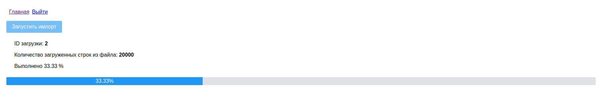
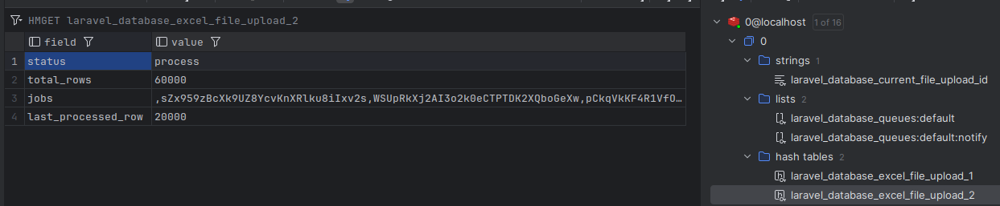
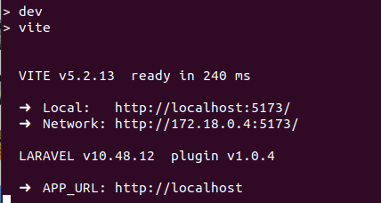
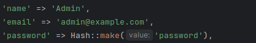

Программа через очередь построчно грузит excel файл в базу. Для хранения информации используется Redis. Процент загрузки передается через сокет на Vue.js.
В панели управления предусмотрена авторизация.

Как поднять на linux:
Клонировать репозиторий, в папке прописать <pre>make install</pre>

Войти в панель можно с этим доступом:

Нажать кнопку "Запустить импорт". Далее можно либо вручную запускать очередь в отдельном окне:
<pre>docker exec excel-jobs-app bash -c "php artisan schedule:run"</pre>
Либо прописать через
<pre>sudo crontab -e</pre>
<pre>* * * * * docker exec excel-jobs-app bash -c "php artisan schedule:run"</pre>